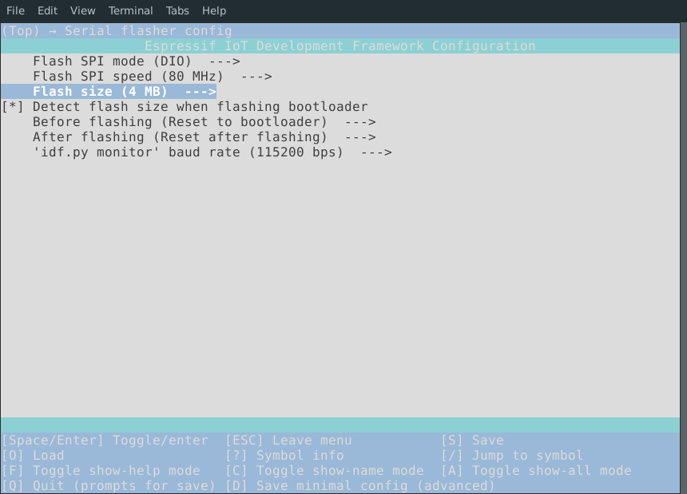
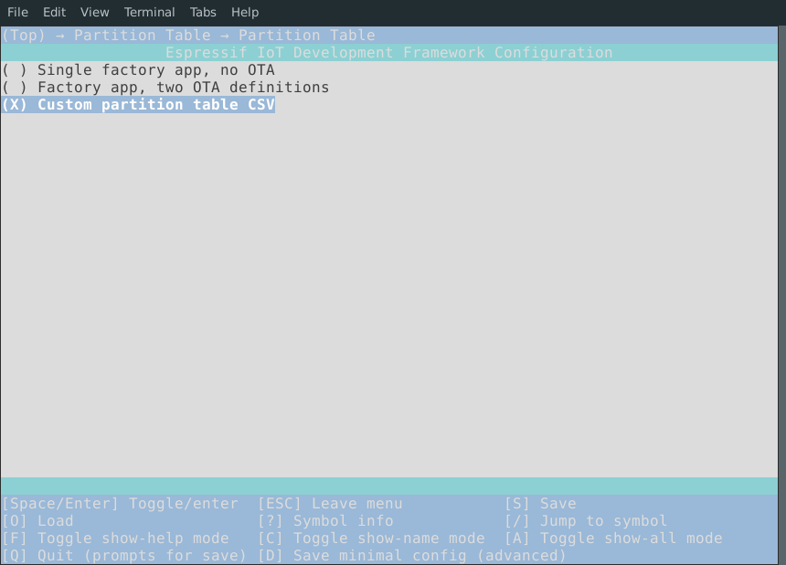
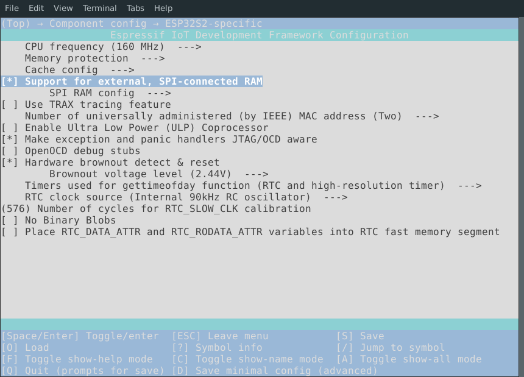

# ESP32-S2-LCD-DevKit

ESP32S2-LCD-DevKit 是乐鑫开发的一块用于调试 GUI 应用的工程调试开发板，开发板上集成了一块  800x480 分辨率的电容式触摸屏，可用于开发交互式 UI 等应用设计，且开发板上预留了 ESP32-WROOM-32D 模组与 ESP32-S2-WROVER 模组焊盘，方便快速切换平台进行调试开发。

#### 硬件

* [主板](Documents/Board_Schematic.pdf)

* [ESP32-S2-WROVER模组](Documents/esp32-s2-wrover_esp32-s2-wrover-i_datasheet_en.pdf)
* LCD模块([NT35510](Documents/NT35510.pdf)+[FT5x16](Documents/FT5x16.pdf))
* [ESP-Prog调试下载器](https://github.com/espressif/esp-iot-solution/blob/master/documents/evaluation_boards/ESP-Prog_guide_cn.md)

#### 软件

* [ESP-IDF release-v4.2](https://github.com/espressif/esp-idf/tree/release/v4.2)
* [LVGL release-v7](https://github.com/lvgl/lvgl/tree/release/v7)

### 快速入门

---

#### 搭建 ESP32-S2 开发环境

* 按照 [ESP-IDF 编程指南](https://docs.espressif.com/projects/esp-idf/zh_CN/latest/esp32/get-started/index.html#)的步骤搭建开发板开发环境

#### 运行工程(以 Linux 为例)

* 克隆工程 && 进入工程目录

  ``` bash
  git clone https://github.com/TreeNewbeer/ESP32-S2-LCD-DevKit.git && cd $PWD/ESP32-S2-LCD-DevKit/Project
  ```

* 设置目标平台

  ``` bash
  idf.py set-target esp32s2
  ```

* 配置工程

  ``` bash
  idf.py menuconfig
  #1) Serial flasher config --> Flash size --> 4MB
  #2) Partition Table --> Partition Table --> Custom partition table CSV
  #3) Component config --> ESP32S2-specific --> SUpport for external, SPI-connected RAM
  ```

  

  

  

* 编译 && 下载工程

  ``` bash
  idf.py flash
  ```

* 打开 idf monitor 查看串口 log

  ``` bash
  idf.py monitor
  ```

  

